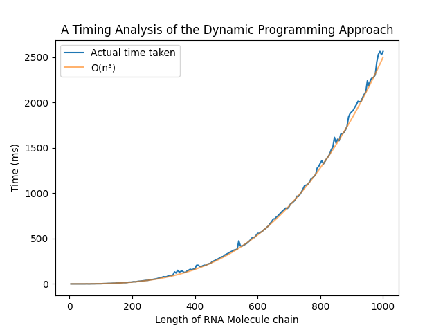

<h1 align="center">CS F364 Assignment 2</h1>

#### Group members:

- T V Chandra Vamsi (2019A7PS0033H)
- Ruban S (2019A7PS0064H)
- Sathvik B (2019A7PS1200H)
- Kaustubh Bhanj (2019A7PS0009H)

 

<h2>Problem Statement</h2>

The aim of the problem is to obtain a secondary structure of maximum energy (The energy of a secondary structure is proportional to the number of base
pairs in it) from a given RNA sequence while following the given [rules](#rules).

<h3 id="rules">Rules</h3>

- An RNA molecule is a string $B = b_1 b_ 2 \ldots b_n; \; b_i \in \{ A, C, G, U \} \; \forall \; 1 \leq i \leq n$
- The pairing of bases are as follows

  - **A**denine always matches with **U**racil.
  - **C**ytosine always matches with **G**uanine.

- Every base pairs with atmost one other base
- (No sharp turns) The ends of each pair are separated by at least 4 intervening bases i.e. if $b_i b_j$ is a pairing, then $i < j-4$
- (No knots) If $b_i b_j$ and $b_k b_l$ are two pairings, then we cannot have $i < k < j < l$

 

<h2>Dynamic Programming Approach</h2>

Using the Dynamic Programming Approach, we consider the entire problem made up of smaller sub-problems that can be recursively solved. Here, a subproblem is defined as finding the maximum number of base pairings for a particular subsequence.

$OPT(i,j)$ is the maximum number of base pairs in a secondary structure for $b_i b_{i+1} \ldots b_j$. Hence, the solution for the problem is $OPT(1,n)$, where $n$ is the length of the RNA sequence.

If $i > j-4$, then $OPT(i,j) = 0$.

In the optimal secondary structure on $b_i b_{i+1} \ldots b_j$,

- If $j$ is not a member of any pair in the subsequence, use $OPT(i,j-1)$
- If $j$ pairs with some $t < j - 4$, the knot condition yields two independent sub-problems; $OPT(i,t-1)$ and $OPT(t+1,j-1)$.

From this, we arrive at the recurrence relation

$$
OPT(i,j) = \max
\begin{cases}
OPT(i,j-1),\\
\max_t (1+OPT(i,t-1)+OPT(t+1,j-1))
\end{cases}
$$

From the above recurrence relation, it can be seen that there are $O(n^2)$ subproblems.

Note that computing $OPT(i,j)$ involves sub-problems $OPT(l,m)$
where $m-l < j-i$. Hence, the way to solve this recurrence relation is to first solve all subproblems of size $s-1$ before moving on to subproblems of size $s$. This is described in the psuedocode mentioned below.

Initialize $OPT(i,j)=0$ whenever $i \geq j-4$ 
For $k = 5,6, \ldots n-1$ 
&nbsp;&nbsp;&nbsp;&nbsp;For $i = 1, 2, \ldots n-k$ 
&nbsp;&nbsp;&nbsp;&nbsp;&nbsp;&nbsp;&nbsp;&nbsp;Set $j=i+k$ 
&nbsp;&nbsp;&nbsp;&nbsp;&nbsp;&nbsp;&nbsp;&nbsp;Compute $OPT(i,j)$ using the recurrence relation 
&nbsp;&nbsp;&nbsp;&nbsp;Endfor 
Endfor 
Return $OPT(1,n)$

 

<h2 id="implementation">Implementation Details</h2>

Since the recurrence relation has two dimensions, a double-dimensional array `maxMatchings` is used for storing the values of $OPT$. Three `for` loops are used to iterate over the double-dimensional array to compute every possible sub-problem.

A structure `Match` is used to store the indices of the matching base pairs.

 

<h2>Time Complexity Analysis</h2>

In the function `calculateMaxMatchings()`, the outermost loop runs from $s = 6 \; to \; n$.

The middle loop runs from $i = 0 \; to \; n+s-1$.

The innermost loop runs from $t = i \; to \; j$, where $j = i+s-1$.

Since there are no `break` statements inside any of the loops, the maximum number of times the statements in the innermost loop can be found by

$\sum_{s=6}^{n} {\sum_{i=0}^{n+s-1} {\sum_{t=i}^{i+s-1} {O(1)}}}$

$= \sum_{s=6}^{n} {\sum_{i=0}^{n+s-1} {(i+s-1-i+1) \cdot {O(1)}}}$

$= \sum_{s=6}^{n} {\sum_{i=0}^{n+s-1} {s \cdot {O(1)}}}$

$= \sum_{s=6}^{n} {s(n+s-1-0+1) \cdot {O(1)}}$

$= \sum_{s=6}^{n} {s(n+s)\cdot {O(1)}}$

$= \sum_{s=6}^{n} {(s^2 + ns) \cdot O(1)}$

$= O(1) \cdot \sum_{s=6}^{n} {(s^2 + ns) }$

$= O(1) \cdot (\sum_{s=6}^{n} {s^2} + \sum_{s=0}^{n} {ns})$

$= O(1) \cdot (\sum_{s=6}^{n} {s^2} + n\sum_{s=0}^{n} {s})$

$= O(1) \cdot ((\sum_{s=0}^{n} {s^2} - \sum_{s=0}^{6} {s^2}) + n(\sum_{s=0}^{n} {s} - \sum_{s=6}^{n} {s}))$

$= O(1) \cdot ((\dfrac{n(n+1)(2n+1)}{6} - \dfrac{6(6+1)(2(6)+1)}{6}) + n(\dfrac{n(n+1)}{2} - \dfrac{6(6+1)}{2}))$

$= O(1) \cdot ((\dfrac{n^3}{3}+\dfrac{n^2}{2}+\dfrac{n}{6} - 91) + n(\dfrac{n^2}{2}+\dfrac{n}{2} - 21))$

$= O(1) \cdot (\dfrac{n^3}{3}+\dfrac{n^2}{2}+\dfrac{n}{6} - 91 + \dfrac{n^3}{2}+\dfrac{n^2}{2} - 21n)$

$= O(1) \cdot (\dfrac{2n^3}{3}+n^2-\dfrac{125n}{6} - 91)$

$= O(n^3)$

 

<h2>Timing Analysis</h2>

</img>

From the above plot, it can be seen that the actual time taken $t$ can be approximated by the curve $t = \dfrac{n^3}{400000}$, which is indeed $O(n^3)$.

 

<h2>Space Complexity Analysis</h2>

As shown in the [the recurrence relation](#recurrence), since there are $O(n^2)$ sub-problems, and each sub-problem requires $O(1)$ space to store its value, the space complexity of the Dynamic Programming Approach is $O(n^2)$.

 

<h2>Test Cases</h2>

The code was tested with the Nucleic Acid Database (NDB) by Rutgers University that has 12016 structures as of April 13th, 2022.

Taking an example from the database; $UUGCGUCGCUCCGGAAAAGUCGC$, the base pairings determined by the algorithm are as shown below.

 

<h2>Conclusion</h2>

We see that using [the recurrence relation](#recurrence), the complexity of the algorithm is exponential, however, when we use memoization to store the results of previously computed sub-problems, we see that the time complexity is reduced to polynomial time ($O(n^3)$), at the cost of $O(n^2)$ space.

